# Complete Use Case Diagrams for /new_issue Command

## Table of Contents
1. [Chat Type Validation Cases](#1-chat-type-validation-cases)
2. [Group Registration & Activation Cases](#2-group-registration--activation-cases)
3. [Description Validation Cases](#3-description-validation-cases)
4. [User Tracking Cases](#4-user-tracking-cases)
5. [Database Operation Cases](#5-database-operation-cases)
6. [Message Pinning Cases](#6-message-pinning-cases)
7. [Company Isolation Cases](#7-company-isolation-cases)
8. [Complete Success Paths](#8-complete-success-paths)
9. [Combined Error Scenarios](#9-combined-error-scenarios)
10. [Edge Cases & Race Conditions](#10-edge-cases--race-conditions)

---

## 1. CHAT TYPE VALIDATION CASES

### Case 1.1: Success - Command Used in Group Chat


**Location:** handlers.py:726
**Result:** ✅ Validation passes, continues to next check
**User Impact:** No message shown, proceeds silently

---

### Case 1.2: Error - Command Used in Private Chat

```mermaid
flowchart TD
    Start([User types /new_issue in PRIVATE chat]) --> CheckChatType{_is_group_chat<br/>check}
    CheckChatType -->|chat.type == 'private'| ChatTypeInvalid[❌ Chat type invalid]
    ChatTypeInvalid --> SendError[Send error message]
    SendError --> ErrorMsg["'This command only works<br/>in groups.'"]
    ErrorMsg --> End([Command terminates])

    style Start fill:#e1f5ff
    style ChatTypeInvalid fill:#f8d7da
    style SendError fill:#f8d7da
    style ErrorMsg fill:#f8d7da
    style End fill:#6c757d
```

**Location:** handlers.py:226
**Result:** ❌ Command terminates immediately
**User Impact:** Error message shown in private chat
**Database Impact:** No operations performed

---

### Case 1.3: Error - Command Used in Channel

```mermaid
flowchart TD
    Start([User types /new_issue in CHANNEL]) --> CheckChatType{_is_group_chat<br/>check}
    CheckChatType -->|chat.type == 'channel'| ChatTypeInvalid[❌ Chat type invalid]
    ChatTypeInvalid --> SendError[Send error message]
    SendError --> ErrorMsg["'This command only works<br/>in groups.'"]
    ErrorMsg --> End([Command terminates])

    style Start fill:#e1f5ff
    style ChatTypeInvalid fill:#f8d7da
    style SendError fill:#f8d7da
    style ErrorMsg fill:#f8d7da
    style End fill:#6c757d
```

**Location:** handlers.py:226
**Result:** ❌ Command terminates immediately
**User Impact:** Error message shown in channel (if bot can respond)
**Database Impact:** No operations performed

---

## 2. GROUP REGISTRATION & ACTIVATION CASES

### Case 2.1: Success - Group Registered and Active

```mermaid
flowchart TD
    Start([Chat type validated]) --> CallRequire[Call _require_active_group]
    CallRequire --> GetMembership[db.get_company_membership<br/>chat.id]
    GetMembership --> CheckExists{Group exists<br/>in database?}
    CheckExists -->|Yes| GetGroupRecord[db.get_group<br/>group_id]
    GetGroupRecord --> CheckActive{group.status<br/>== 'active'?}
    CheckActive -->|Yes| ReturnMembership[✅ Return membership object]
    ReturnMembership --> ProceedNext[Proceed to description<br/>validation]

    style Start fill:#fff3cd
    style ReturnMembership fill:#d4edda
    style ProceedNext fill:#fff3cd
```

**Location:** handlers.py:159-179, database.py:522-533
**Result:** ✅ Returns membership with company_id, group_id, role lists
**Data Returned:**
```python
{
    'group_id': 123456,
    'company_id': 1,
    'company_name': 'Acme Corp',
    'is_active': True,
    'dispatcher_ids': [111, 222],
    'manager_ids': [333, 444]
}
```

---

### Case 2.2: Error - Group Not Registered

```mermaid
flowchart TD
    Start([Chat type validated]) --> CallRequire[Call _require_active_group]
    CallRequire --> GetMembership[db.get_company_membership<br/>chat.id]
    GetMembership --> CheckExists{Group exists<br/>in database?}
    CheckExists -->|No| GroupNotFound[❌ Group record not found]
    GroupNotFound --> SendError[Send error message]
    SendError --> ErrorMsg["'This group is not registered yet.<br/>Please invite the bot and complete<br/>activation first.'"]
    ErrorMsg --> ReturnNone[Return None]
    ReturnNone --> CheckReturn{membership<br/>is None?}
    CheckReturn -->|Yes| Terminate([Command terminates])

    style Start fill:#fff3cd
    style GroupNotFound fill:#f8d7da
    style SendError fill:#f8d7da
    style ErrorMsg fill:#f8d7da
    style Terminate fill:#6c757d
```

**Location:** handlers.py:167-173
**Result:** ❌ Command terminates
**User Impact:** User sees registration instructions
**Database Impact:** No writes performed
**Recovery:** Platform admin must run /attach_group command

---

### Case 2.3: Error - Group Pending Activation

```mermaid
flowchart TD
    Start([Chat type validated]) --> CallRequire[Call _require_active_group]
    CallRequire --> GetMembership[db.get_company_membership<br/>chat.id]
    GetMembership --> CheckExists{Group exists<br/>in database?}
    CheckExists -->|Yes| GetGroupRecord[db.get_group<br/>group_id]
    GetGroupRecord --> CheckActive{group.status<br/>== 'active'?}
    CheckActive -->|No, status='pending'| GroupPending[❌ Group pending activation]
    GroupPending --> CallNotify[Call _notify_pending_activation]
    CallNotify --> CheckRequestedName{Group has<br/>requested_company_name?}
    CheckRequestedName -->|Yes| ShowWithName["Show: 'This group is pending<br/>activation for company:<br/>{requested_company_name}'"]
    CheckRequestedName -->|No| ShowGeneric["Show: 'This group is pending<br/>activation. Please reply to<br/>the registration prompt...'"]
    ShowWithName --> ReturnNone[Return None]
    ShowGeneric --> ReturnNone
    ReturnNone --> Terminate([Command terminates])

    style Start fill:#fff3cd
    style GroupPending fill:#f8d7da
    style ShowWithName fill:#f8d7da
    style ShowGeneric fill:#f8d7da
    style Terminate fill:#6c757d
```

**Location:** handlers.py:175-177, 142-157
**Result:** ❌ Command terminates
**User Impact:** User sees pending activation notice
**Database State:**
```sql
groups.status = 'pending'
groups.requested_company_name = 'CompanyName' (optional)
```
**Recovery:** Platform admin must approve via /attach_group

---

### Case 2.4: Error - Group Active but No Company Attached (Edge Case)

```mermaid
flowchart TD
    Start([Chat type validated]) --> CallRequire[Call _require_active_group]
    CallRequire --> GetMembership[db.get_company_membership<br/>chat.id]
    GetMembership --> GetGroup[db.get_group<br/>group_id]
    GetGroup --> CheckCompany{group.company_id<br/>is None?}
    CheckCompany -->|Yes - Data Inconsistency!| DataError[❌ Group active but no<br/>company attachment]
    DataError --> GetCompanyFails[db.get_company_by_id<br/>returns None]
    GetCompanyFails --> ReturnPartial[Return partial membership<br/>company_id = None]
    ReturnPartial --> CreateIncident[create_incident called]
    CreateIncident --> NullCompany[Incident created with<br/>company_id = NULL]
    NullCompany --> IsolationBroken[⚠️ MULTI-TENANT<br/>ISOLATION BROKEN]

    style Start fill:#fff3cd
    style DataError fill:#f8d7da
    style IsolationBroken fill:#dc3545,color:#fff
```

**Location:** database.py:522-533, 841-866
**Result:** ⚠️ Incident created without company isolation
**Database State:**
```sql
incidents.company_id = NULL  -- Violates multi-tenant architecture
```
**Risk Level:** 🔴 CRITICAL - Cross-company data exposure
**Prevention:** Foreign key constraint should prevent this:
```sql
company_id INTEGER REFERENCES companies(company_id)
```

---

## 3. DESCRIPTION VALIDATION CASES

### Case 3.1: Success - Valid Description (Normal Length)

```mermaid
flowchart TD
    Start([Group validated as active]) --> CheckArgs{context.args<br/>provided?}
    CheckArgs -->|Yes| JoinArgs[description = ' '.join<br/>context.args]
    JoinArgs --> CheckMaxLen{len <= 3000?}
    CheckMaxLen -->|Yes| CheckMinLen{len.strip >= 5?}
    CheckMinLen -->|Yes| DescValid[✅ Description valid]
    DescValid --> ProceedTracking[Proceed to user tracking]

    style Start fill:#fff3cd
    style DescValid fill:#d4edda
    style ProceedTracking fill:#fff3cd
```

**Location:** handlers.py:739-764
**Example Input:** `/new_issue Truck 123 has a flat tire`
**Result:** ✅ Description = "Truck 123 has a flat tire" (27 chars)
**Next Step:** User tracking via _track_user_interaction

---

### Case 3.2: Error - No Description Provided

```mermaid
flowchart TD
    Start([Group validated as active]) --> CheckArgs{context.args<br/>provided?}
    CheckArgs -->|No - Empty list| NoArgs[❌ No description]
    NoArgs --> SendUsage[Send usage instructions]
    SendUsage --> UsageMsg["'Usage: /new_issue description<br/>Example: /new_issue Truck 123<br/>has a flat tire'"]
    UsageMsg --> Return[return - terminates]
    Return --> End([Command terminates])

    style Start fill:#fff3cd
    style NoArgs fill:#f8d7da
    style SendUsage fill:#f8d7da
    style UsageMsg fill:#f8d7da
    style End fill:#6c757d
```

**Location:** handlers.py:740-745
**User Input:** `/new_issue` (no arguments)
**Result:** ❌ Command terminates with usage instructions
**Database Impact:** No operations performed

---

### Case 3.3: Error - Description Too Short


**Location:** handlers.py:759-764
**Example Input:** `/new_issue Fix` (3 chars after strip)
**Result:** ❌ Command terminates
**Edge Case:** `/new_issue "    X    "` - Only 1 char after strip

---

### Case 3.4: Error - Description Too Long

```mermaid
flowchart TD
    Start([Group validated as active]) --> CheckArgs{context.args<br/>provided?}
    CheckArgs -->|Yes| JoinArgs[description = ' '.join<br/>context.args]
    JoinArgs --> CheckMaxLen{len <= 3000?}
    CheckMaxLen -->|No - Over 3000 chars| TooLong[❌ Description exceeds limit]
    TooLong --> SendError[Send error message]
    SendError --> ErrorMsg["'Description too long.<br/>Maximum 3000 characters allowed.<br/>You entered: {len} characters'"]
    ErrorMsg --> Return[return - terminates]
    Return --> End([Command terminates])

    style Start fill:#fff3cd
    style TooLong fill:#f8d7da
    style SendError fill:#f8d7da
    style ErrorMsg fill:#f8d7da
    style End fill:#6c757d
```

**Location:** handlers.py:752-757
**Constant:** MAX_DESCRIPTION_LENGTH = 3000
**Reason:** Telegram message limit is 4096, reserves space for template
**Example Input:** `/new_issue [3001 character description]`
**Result:** ❌ Command terminates with character count shown

---

### Case 3.5: Edge Case - Description Exactly 3000 Characters

```mermaid
flowchart TD
    Start([Group validated as active]) --> CheckArgs{context.args<br/>provided?}
    CheckArgs -->|Yes| JoinArgs[description = ' '.join<br/>context.args]
    JoinArgs --> CheckMaxLen{len <= 3000?}
    CheckMaxLen -->|Yes - Exactly 3000| BoundaryCase[✅ At exact boundary]
    BoundaryCase --> CheckMinLen{len.strip >= 5?}
    CheckMinLen -->|Yes| DescValid[✅ Description valid]
    DescValid --> ProceedTracking[Proceed to user tracking]

    style Start fill:#fff3cd
    style BoundaryCase fill:#d4edda
    style DescValid fill:#d4edda
    style ProceedTracking fill:#fff3cd
```

**Location:** handlers.py:752
**Condition:** `if len(description) > MAX_DESCRIPTION_LENGTH:` (uses >, not >=)
**Result:** ✅ 3000 characters is accepted
**Test Case:** Exactly 3000 char string should pass

---

### Case 3.6: Edge Case - Description Exactly 5 Characters

```mermaid
flowchart TD
    Start([Group validated as active]) --> CheckArgs{context.args<br/>provided?}
    CheckArgs -->|Yes| JoinArgs[description = ' '.join<br/>context.args]
    JoinArgs --> CheckMaxLen{len <= 3000?}
    CheckMaxLen -->|Yes| CheckMinLen{len.strip >= 5?}
    CheckMinLen -->|Yes - Exactly 5 after strip| BoundaryCase[✅ Minimum valid length]
    BoundaryCase --> DescValid[✅ Description valid]
    DescValid --> ProceedTracking[Proceed to user tracking]

    style Start fill:#fff3cd
    style BoundaryCase fill:#d4edda
    style DescValid fill:#d4edda
    style ProceedTracking fill:#fff3cd
```

**Location:** handlers.py:759
**Condition:** `if len(description.strip()) < 5:` (uses <, not <=)
**Result:** ✅ 5 characters after strip is accepted
**Example Input:** `/new_issue "  Hello  "` - 5 chars after strip

---

### Case 3.7: Edge Case - Description with Only Whitespace


**Location:** handlers.py:759-764
**Example Input:** `/new_issue "          "` (only spaces)
**Result:** ❌ Command terminates
**Note:** Uses `.strip()` to prevent whitespace-only descriptions

---

## 4. USER TRACKING CASES

### Case 4.1: Success - User with Full Profile Information

```mermaid
flowchart TD
    Start([Description validated]) --> CallTrack[_track_user_interaction<br/>user, group_id]
    CallTrack --> ExtractData[Extract user data:<br/>id, username, first_name,<br/>last_name, language_code]
    ExtractData --> CallDB[db.track_user<br/>All 8 parameters]
    CallDB --> CheckExists{User exists<br/>in database?}
    CheckExists -->|Yes| UpdateUser[UPDATE users<br/>COALESCE preserves existing]
    CheckExists -->|No| InsertUser[INSERT new user]
    UpdateUser --> UpdateGroups[Add group_id to<br/>group_connections array]
    InsertUser --> UpdateGroups
    UpdateGroups --> SetTimestamp[Update updated_at<br/>timestamp]
    SetTimestamp --> LogSuccess[✅ Log: Tracked user {id}<br/>with full data]
    LogSuccess --> ProceedIncident[Proceed to incident<br/>creation]

    style Start fill:#fff3cd
    style LogSuccess fill:#d4edda
    style ProceedIncident fill:#fff3cd
```

**Location:** handlers.py:766-769, database.py:628-714
**Data Captured:**
```python
{
    'user_id': 123456789,
    'username': 'john_doe',
    'first_name': 'John',
    'last_name': 'Doe',
    'language_code': 'en',
    'is_bot': False,
    'group_connections': '[987654, 123456]',
    'team_role': 'Driver'  # Preserved from previous
}
```

---

### Case 4.2: Success - User Without Username

```mermaid
flowchart TD
    Start([Description validated]) --> CallTrack[_track_user_interaction<br/>user, group_id]
    CallTrack --> ExtractData[Extract user data]
    ExtractData --> CheckUsername{user.username<br/>exists?}
    CheckUsername -->|No - username is None| UseIDFallback[telegram_handle =<br/>f'User_{user.id}']
    UseIDFallback --> CallDB[db.track_user<br/>username=None]
    CallDB --> Upsert[UPSERT operation]
    Upsert --> StoreNull[Store username as NULL<br/>in database]
    StoreNull --> LogSuccess[✅ Log: Tracked user {id}<br/>User_{id}]
    LogSuccess --> CreateHandle[created_by_handle =<br/>'@User_123456789']
    CreateHandle --> ProceedIncident[Proceed to incident creation]

    style Start fill:#fff3cd
    style UseIDFallback fill:#fff3cd
    style LogSuccess fill:#d4edda
    style ProceedIncident fill:#fff3cd
```

**Location:** handlers.py:108-111, database.py:637
**Fallback Logic:**
```python
def _get_user_handle(self, user) -> str:
    if user.username:
        return f"@{user.username}"
    return f"User_{user.id}"  # Fallback for users without username
```
**Incident Display:** `Reported by: @User_123456789`

---

### Case 4.3: Edge Case - User is a Bot

```mermaid
flowchart TD
    Start([Description validated]) --> CallTrack[_track_user_interaction<br/>user, group_id]
    CallTrack --> ExtractData[Extract user data]
    ExtractData --> CheckBot{user.is_bot<br/>== True?}
    CheckBot -->|Yes - Bot account| SetBotFlag[is_bot = True]
    SetBotFlag --> CallDB[db.track_user<br/>is_bot=True]
    CallDB --> Upsert[UPSERT operation]
    Upsert --> LogBot[✅ Log: Tracked user {id}<br/>BOT detected]
    LogBot --> ProceedIncident[Proceed to incident creation<br/>⚠️ Bot created incident]

    style Start fill:#fff3cd
    style CheckBot fill:#fff3cd
    style LogBot fill:#d4edda
    style ProceedIncident fill:#ffc107
```

**Location:** handlers.py:66, database.py:632
**Result:** ✅ Bot can create incidents (no bot filter)
**Database:**
```sql
is_bot = 1 (TRUE)
```
**Security Note:** Consider adding bot check to prevent bot spam

---

### Case 4.4: Success - User Already in Database (Update)

```mermaid
flowchart TD
    Start([Description validated]) --> CallTrack[_track_user_interaction]
    CallTrack --> CallDB[db.track_user]
    CallDB --> CheckExists{User {id} exists?}
    CheckExists -->|Yes - UPDATE path| PreserveData[COALESCE preserves:<br/>username, first_name,<br/>last_name, team_role]
    PreserveData --> UpdateNew[Update only new data:<br/>language_code,<br/>is_bot flag]
    UpdateNew --> CheckGroupConn{group_id in<br/>group_connections?}
    CheckGroupConn -->|No| AddGroup[Add to group_connections<br/>JSON array]
    CheckGroupConn -->|Yes - Already exists| SkipGroup[Skip duplicate group]
    AddGroup --> UpdateTimestamp[Set updated_at =<br/>CURRENT_TIMESTAMP]
    SkipGroup --> UpdateTimestamp
    UpdateTimestamp --> LogSuccess[✅ Log: Updated user {id}]
    LogSuccess --> ProceedIncident[Proceed to incident creation]

    style Start fill:#fff3cd
    style PreserveData fill:#d4edda
    style LogSuccess fill:#d4edda
    style ProceedIncident fill:#fff3cd
```

**Location:** database.py:658-710
**COALESCE Logic:** Prevents overwriting existing data with NULL
**Example:**
```sql
username = COALESCE(?, username)  -- Keeps old if new is NULL
```
**Array Management:** Prevents duplicate group_ids in JSON array

---

### Case 4.5: Success - New User First Time in System

```mermaid
flowchart TD
    Start([Description validated]) --> CallTrack[_track_user_interaction]
    CallTrack --> CallDB[db.track_user]
    CallDB --> CheckExists{User {id} exists?}
    CheckExists -->|No - INSERT path| CreateUser[INSERT new user record]
    CreateUser --> SetCreated[created_at =<br/>CURRENT_TIMESTAMP]
    SetCreated --> SetUpdated[updated_at =<br/>CURRENT_TIMESTAMP]
    SetUpdated --> InitGroups[group_connections =<br/>'[{group_id}]']
    InitGroups --> DefaultRole[team_role = NULL<br/>Until assigned]
    DefaultRole --> LogSuccess[✅ Log: Created new user {id}]
    LogSuccess --> ProceedIncident[Proceed to incident creation]

    style Start fill:#fff3cd
    style CreateUser fill:#d4edda
    style LogSuccess fill:#d4edda
    style ProceedIncident fill:#fff3cd
```

**Location:** database.py:628-714
**Initial State:**
```sql
INSERT INTO users (
    user_id, username, first_name, last_name,
    language_code, is_bot, group_connections,
    team_role, created_at, updated_at
) VALUES (
    123456, 'john', 'John', 'Doe',
    'en', 0, '[987654]',
    NULL, '2025-11-19T12:00:00', '2025-11-19T12:00:00'
)
```

---

### Case 4.6: Edge Case - User Changes Name/Username

```mermaid
flowchart TD
    Start([User previously tracked as 'OldName']) --> UseCommand[User now 'NewName' uses /new_issue]
    UseCommand --> CallTrack[_track_user_interaction]
    CallTrack --> ExtractNew[Extract current data:<br/>username='NewName'<br/>first_name='NewFirst']
    ExtractNew --> CallDB[db.track_user]
    CallDB --> UpdateLogic{UPDATE path}
    UpdateLogic --> COALESCE[COALESCE logic:<br/>username = COALESCE<br/>new, old]
    COALESCE --> CheckNull{New username<br/>is NOT NULL?}
    CheckNull -->|Yes - Has value| OverwriteOld[✅ Update username<br/>to 'NewName']
    CheckNull -->|No - NULL provided| KeepOld[Keep old username<br/>'OldName']
    OverwriteOld --> UpdateTimestamp[Update updated_at]
    KeepOld --> UpdateTimestamp
    UpdateTimestamp --> LogSuccess[✅ Log: Updated user data]
    LogSuccess --> ProceedIncident[Proceed to incident creation]

    style Start fill:#fff3cd
    style OverwriteOld fill:#d4edda
    style KeepOld fill:#fff3cd
    style LogSuccess fill:#d4edda
    style ProceedIncident fill:#fff3cd
```

**Location:** database.py:658-710
**COALESCE Behavior:**
- If user changes Telegram username → Database updates
- If Telegram API returns NULL → Database preserves old value
- Prevents data loss from API inconsistencies

---

## 5. DATABASE OPERATION CASES

### Case 5.1: Success - Incident Creation with Unique ID

```mermaid
flowchart TD
    Start([User tracked successfully]) --> AcquireLock[Acquire self._lock]
    AcquireLock --> GetCompany[Extract company_id<br/>from group_info]
    GetCompany --> GenID[generate_incident_id<br/>company_id, group_id]
    GenID --> QueryLatest[SELECT MAX incident_id<br/>WHERE year = 2025]
    QueryLatest --> ParseSeq[Extract sequence number<br/>from NNNN]
    ParseSeq --> Increment[New sequence = max + 1]
    Increment --> FormatID[Format: 0042]
    FormatID --> InsertIncident[INSERT INTO incidents]
    InsertIncident --> SetFields[Set all fields:<br/>incident_id, group_id,<br/>company_id, status='Unclaimed']
    SetFields --> Commit[COMMIT transaction]
    Commit --> ReleaseLock[Release lock]
    ReleaseLock --> ReturnIncident[✅ Return incident object]
    ReturnIncident --> ProceedMessage[Proceed to message building]

    style Start fill:#fff3cd
    style AcquireLock fill:#fff3cd
    style FormatID fill:#d4edda
    style Commit fill:#d4edda
    style ReturnIncident fill:#d4edda
    style ProceedMessage fill:#fff3cd
```

**Location:** handlers.py:771-778, database.py:841-866, 818-839
**Thread Safety:** `with self._lock:` ensures atomic operations
**Incident Created:**
```sql
INSERT INTO incidents VALUES (
    '0042',      -- Unique ID
    987654,               -- group_id
    1,                    -- company_id
    NULL,                 -- pinned_message_id (set later)
    'Unclaimed',          -- status
    123456,               -- created_by_id
    '@john_doe',          -- created_by_handle
    'Truck 123 flat tire',-- description
    '2025-11-19T12:00:00' -- t_created
)
```

---

### Case 5.2: Success - First Incident of New Year

```mermaid
flowchart TD
    Start([User tracked successfully]) --> AcquireLock[Acquire self._lock]
    AcquireLock --> GenID[generate_incident_id]
    GenID --> GetYear[current_year = datetime.now.year<br/>= 2026]
    GetYear --> QueryLatest[SELECT MAX incident_id<br/>WHERE year = 2026]
    QueryLatest --> NoResults{Query returns<br/>empty set?}
    NoResults -->|Yes - First incident of year| DefaultSeq[sequence = 0]
    DefaultSeq --> Increment[New sequence = 1]
    Increment --> FormatID[Format: 0001]
    FormatID --> InsertIncident[INSERT INTO incidents]
    InsertIncident --> Commit[✅ COMMIT transaction]
    Commit --> YearRollover[🎉 Year rollover successful<br/>Sequence reset to 0001]
    YearRollover --> ReturnIncident[Return incident object]
    ReturnIncident --> ProceedMessage[Proceed to message building]

    style Start fill:#fff3cd
    style NoResults fill:#fff3cd
    style DefaultSeq fill:#fff3cd
    style FormatID fill:#d4edda
    style YearRollover fill:#d4edda
    style ReturnIncident fill:#d4edda
    style ProceedMessage fill:#fff3cd
```

**Location:** database.py:822-839
**Year Extraction Logic:**
```python
current_year = datetime.now().year
# Query filters by year extracted from incident_id pattern
```
**Sequence Reset:** Each year starts at 0001

---

### Case 5.3: Edge Case - Concurrent Incident Creation (Race Condition)

```mermaid
flowchart TD
    Start([Two users submit /new_issue<br/>simultaneously]) --> User1[User 1 thread]
    Start --> User2[User 2 thread]

    User1 --> Lock1[Try acquire lock]
    User2 --> Lock2[Try acquire lock]

    Lock1 -->|Acquired first| U1Gen[User 1: Generate ID<br/>0042]
    Lock2 -->|Blocked - Waiting| U2Wait[User 2: WAIT for lock]

    U1Gen --> U1Insert[User 1: INSERT incident]
    U1Insert --> U1Commit[User 1: COMMIT]
    U1Commit --> U1Release[User 1: Release lock]

    U1Release --> U2Acquire[User 2: Acquire lock]
    U2Acquire --> U2Gen[User 2: Generate ID<br/>Queries latest = 0042]
    U2Gen --> U2Inc[User 2: Increment to 0043]
    U2Inc --> U2Format[User 2: 0043]
    U2Format --> U2Insert[User 2: INSERT incident]
    U2Insert --> U2Commit[User 2: COMMIT]
    U2Commit --> U2Release[User 2: Release lock]

    U2Release --> Success[✅ No collision!<br/>0042 and<br/>0043 both created]

    style Start fill:#e1f5ff
    style U2Wait fill:#ffc107
    style Success fill:#d4edda
```

**Location:** database.py:843 - `with self._lock:`
**Thread Safety Mechanism:** Python threading.Lock()
**Result:** ✅ Prevents duplicate incident IDs
**Performance Impact:** Sequential processing under high load

---

### Case 5.4: Edge Case - Database Constraint Violation

```mermaid
flowchart TD
    Start([User tracked successfully]) --> CreateIncident[db.create_incident]
    CreateIncident --> TryInsert{Try INSERT}
    TryInsert -->|Constraint violation| CheckConstraint{Which constraint?}

    CheckConstraint -->|PRIMARY KEY| DuplicateID[❌ Duplicate incident_id<br/>SHOULD NEVER HAPPEN]
    CheckConstraint -->|FOREIGN KEY| InvalidCompany[❌ company_id not in<br/>companies table]
    CheckConstraint -->|CHECK status| InvalidStatus[❌ Invalid status value]

    DuplicateID --> RaiseError[sqlite3.IntegrityError]
    InvalidCompany --> RaiseError
    InvalidStatus --> RaiseError

    RaiseError --> CatchException[Catch in handlers.py]
    CatchException --> LogError[❌ Log: Database error]
    LogError --> UserError[Send to user:<br/>'An error occurred creating<br/>the incident']
    UserError --> Rollback[ROLLBACK transaction]
    Rollback --> End([Command terminates])

    style Start fill:#fff3cd
    style DuplicateID fill:#dc3545,color:#fff
    style InvalidCompany fill:#f8d7da
    style InvalidStatus fill:#f8d7da
    style Rollback fill:#6c757d
    style End fill:#6c757d
```

**Location:** database.py:841-866
**Possible Constraints:**
```sql
PRIMARY KEY (incident_id)
FOREIGN KEY (company_id) REFERENCES companies(company_id)
CHECK (status IN ('Unclaimed', 'Claimed_T1', ...))
```
**Prevention:** Lock prevents PRIMARY KEY violations
**Recovery:** User must retry command

---

### Case 5.5: Success - Update Incident with Message ID

```mermaid
flowchart TD
    Start([Message sent successfully]) --> Extract[Extract sent_message.message_id<br/>= 12345]
    Extract --> CallUpdate[db.update_incident_message_id<br/>incident_id, message_id]
    CallUpdate --> UpdateSQL[UPDATE incidents<br/>SET pinned_message_id = ?<br/>WHERE incident_id = ?]
    UpdateSQL --> Commit[COMMIT transaction]
    Commit --> Verify[Verify cursor.rowcount == 1]
    Verify --> Success[✅ Message ID stored]
    Success --> EnableEditing[Enables future message<br/>editing via edit_message_text]
    EnableEditing --> ProceedPin[Proceed to pinning]

    style Start fill:#fff3cd
    style Success fill:#d4edda
    style EnableEditing fill:#d4edda
    style ProceedPin fill:#fff3cd
```

**Location:** handlers.py:793-794, database.py (update method)
**Purpose:** Stores Telegram message_id for future editing
**Database:**
```sql
UPDATE incidents
SET pinned_message_id = 12345
WHERE incident_id = '0042'
```
**Used By:** Message editing when status changes (claim, escalate, resolve)

---

## 6. MESSAGE PINNING CASES

### Case 6.1: Success - Message Pinned Successfully

```mermaid
flowchart TD
    Start([Incident message sent]) --> CallPin[context.bot.pin_chat_message<br/>chat_id, message_id]
    CallPin --> BotPerms{Bot has<br/>'can_pin_messages'<br/>permission?}
    BotPerms -->|Yes| PinSuccess[✅ Message pinned]
    PinSuccess --> NotifyGroup[Telegram notification sent<br/>disable_notification=False]
    NotifyGroup --> LogSuccess[Log: Created and pinned<br/>incident {id} in group {gid}]
    LogSuccess --> SuccessMsg[Send to user:<br/>'✅ Incident 0042<br/>created and pinned']
    SuccessMsg --> End([Command completes successfully])

    style Start fill:#fff3cd
    style PinSuccess fill:#d4edda
    style LogSuccess fill:#d4edda
    style SuccessMsg fill:#d4edda
    style End fill:#28a745,color:#fff
```

**Location:** handlers.py:796-811
**Requirements:**
- Bot must have `can_pin_messages` permission
- User who added bot must be admin (inherited permissions)
**Telegram API:** `pinChatMessage` method
**Notification:** Group members see "📌 Message was pinned"

---

### Case 6.2: Partial Success - Incident Created but Pin Failed (Permission)

```mermaid
flowchart TD
    Start([Incident message sent<br/>✅ Incident exists in DB]) --> CallPin[context.bot.pin_chat_message]
    CallPin --> BotPerms{Bot has<br/>pin permission?}
    BotPerms -->|No| PermissionDenied[TelegramError:<br/>'Not enough rights to<br/>pin a message']
    PermissionDenied --> CatchError[Catch TelegramError]
    CatchError --> LogError[Log: Error creating<br/>incident message: {e}]
    LogError --> PartialSuccess[Send to user:<br/>'Created incident 0042<br/>but couldn't pin the message.<br/>Make sure the bot has<br/>pin message permissions.']
    PartialSuccess --> IncidentExists[⚠️ Incident exists but unpinned]
    IncidentExists --> ManualPin[Admin must manually pin<br/>OR grant bot permissions]
    ManualPin --> End([Command completes with warning])

    style Start fill:#fff3cd
    style PermissionDenied fill:#ffc107
    style PartialSuccess fill:#ffc107
    style IncidentExists fill:#ffc107
    style End fill:#ffc107
```

**Location:** handlers.py:805-811
**Error:** `telegram.error.TelegramError`
**Incident State:**
```sql
incident_id = '0042'
status = 'Unclaimed'
pinned_message_id = 12345  -- Message exists
```
**Recovery:**
1. Admin grants bot pin permissions
2. Admin manually pins message
3. Future incidents will pin successfully

---

### Case 6.3: Partial Success - Pin Failed (Bot Not Admin)

```mermaid
flowchart TD
    Start([Incident message sent]) --> CallPin[context.bot.pin_chat_message]
    CallPin --> CheckAdmin{Bot is admin<br/>in group?}
    CheckAdmin -->|No - Bot is regular member| NotAdmin[TelegramError:<br/>'Not enough rights']
    NotAdmin --> CatchError[Catch TelegramError]
    CatchError --> LogError[Log error]
    LogError --> PartialSuccess[Send warning message]
    PartialSuccess --> Explanation[⚠️ Bot must be promoted<br/>to admin with pin permissions]
    Explanation --> IncidentOK[Incident created successfully<br/>Can still be claimed via button]
    IncidentOK --> ManualFix[Admin must promote bot<br/>to admin role]
    ManualFix --> End([Command completes with warning])

    style Start fill:#fff3cd
    style NotAdmin fill:#ffc107
    style PartialSuccess fill:#ffc107
    style Explanation fill:#ffc107
    style End fill:#ffc107
```

**Location:** handlers.py:805-811
**Common Cause:** Bot added but not promoted to admin
**Fix:** Group admin runs: `Settings → Administrators → Add Bot → Grant "Pin Messages"`

---

### Case 6.4: Edge Case - Pin Failed (Group Chat Converted to Supergroup)

```mermaid
flowchart TD
    Start([Incident message sent in GROUP]) --> CallPin[context.bot.pin_chat_message<br/>chat_id = OLD_GROUP_ID]
    CallPin --> CheckMigration{Group migrated<br/>to supergroup?}
    CheckMigration -->|Yes - Migration occurred| MigrationError[TelegramError:<br/>'Bad Request: group chat<br/>was upgraded to supergroup']
    MigrationError --> CatchError[Catch TelegramError]
    CatchError --> LogError[Log migration error]
    LogError --> PartialSuccess[Send warning message]
    PartialSuccess --> DBOutdated[❌ Database has old group_id<br/>Incident linked to dead group]
    DBOutdated --> Recovery[⚠️ Bot must handle<br/>chat_migration event]
    Recovery --> UpdateDB[Update groups table<br/>old_id → new_supergroup_id]
    UpdateDB --> End([Manual intervention required])

    style Start fill:#fff3cd
    style MigrationError fill:#dc3545,color:#fff
    style DBOutdated fill:#f8d7da
    style Recovery fill:#ffc107
    style End fill:#6c757d
```

**Location:** handlers.py:805-811
**Telegram Behavior:** Group → Supergroup migration changes chat_id
**Current Code:** ⚠️ Does not handle `migrate_to_chat_id` event
**Fix Required:** Implement `chat_member_updated_handler` to update group_id

---

### Case 6.5: Edge Case - Pin Failed (Too Many Pinned Messages)

```mermaid
flowchart TD
    Start([Incident message sent]) --> CallPin[context.bot.pin_chat_message]
    CallPin --> CheckLimit{Group has<br/>max pinned messages?}
    CheckLimit -->|Yes - Some Telegram clients limit| PinLimit[TelegramError:<br/>'Too many pinned messages']
    PinLimit --> CatchError[Catch TelegramError]
    CatchError --> LogError[Log error]
    LogError --> PartialSuccess[Send warning message]
    PartialSuccess --> UnpinOld[Suggest: Unpin old incidents<br/>to free space]
    UnpinOld --> IncidentOK[Incident created successfully<br/>Can still be claimed]
    IncidentOK --> End([Command completes with warning])

    style Start fill:#fff3cd
    style PinLimit fill:#ffc107
    style PartialSuccess fill:#ffc107
    style End fill:#ffc107
```

**Location:** handlers.py:805-811
**Limit:** Telegram allows multiple pins, but some clients show limited UI
**Solution:** Implement auto-unpin of resolved incidents

---

## 7. COMPANY ISOLATION CASES

### Case 7.1: Success - Multi-Tenant Isolation Enforced

```mermaid
flowchart TD
    Start([User in Group A<br/>Company 1]) --> GetMembership[get_company_membership<br/>Group A]
    GetMembership --> ExtractCompany[company_id = 1<br/>company_name = 'Acme Corp']
    ExtractCompany --> CreateIncident[create_incident<br/>with company_id=1]
    CreateIncident --> InsertDB[INSERT incidents<br/>company_id = 1]
    InsertDB --> Isolation[✅ Incident tagged with<br/>Company 1]
    Isolation --> FutureQueries[All future queries filter:<br/>WHERE company_id = 1]
    FutureQueries --> NoLeakage[Company 1 users cannot see<br/>Company 2 incidents]
    NoLeakage --> Success[✅ Multi-tenant isolation<br/>enforced]

    style Start fill:#e1f5ff
    style Isolation fill:#d4edda
    style NoLeakage fill:#d4edda
    style Success fill:#28a745,color:#fff
```

**Location:** handlers.py:771, database.py:847
**Database Schema:**
```sql
incidents.company_id → companies.company_id (FOREIGN KEY)
```
**Query Example:**
```sql
SELECT * FROM incidents WHERE company_id = 1 AND status = 'Unclaimed'
-- Never returns Company 2 incidents
```

---

### Case 7.2: Success - Same User in Multiple Companies

```mermaid
flowchart TD
    Start([User 123456 in TWO groups]) --> Group1[User uses /new_issue<br/>in Group A - Company 1]
    Start --> Group2[Later: User uses /new_issue<br/>in Group B - Company 2]

    Group1 --> GetMem1[get_company_membership<br/>Group A]
    GetMem1 --> Company1[company_id = 1]
    Company1 --> Create1[Create incident<br/>0042<br/>company_id = 1]
    Create1 --> Tagged1[✅ Tagged Company 1]

    Group2 --> GetMem2[get_company_membership<br/>Group B]
    GetMem2 --> Company2[company_id = 2]
    Company2 --> Create2[Create incident<br/>0001<br/>company_id = 2]
    Create2 --> Tagged2[✅ Tagged Company 2]

    Tagged1 --> Isolated[Both incidents isolated<br/>by company_id]
    Tagged2 --> Isolated
    Isolated --> UserData[User 123456 tracked once<br/>group_connections = '[GroupA, GroupB]']
    UserData --> Success[✅ User can work across<br/>companies without leakage]

    style Start fill:#e1f5ff
    style Tagged1 fill:#d4edda
    style Tagged2 fill:#d4edda
    style Success fill:#28a745,color:#fff
```

**Location:** handlers.py:766-778
**User Record:**
```json
{
    "user_id": 123456,
    "group_connections": "[987654, 112233]",
    "team_role": null  // No global role
}
```
**Incident IDs:** Independent sequences per company (both can have 0042)

---

### Case 7.3: Error - Group Not Attached to Any Company

```mermaid
flowchart TD
    Start([Platform admin created group<br/>but didn't attach to company]) --> GetMembership[get_company_membership<br/>group_id]
    GetMembership --> GetGroup[db.get_group returns:<br/>company_id = NULL]
    GetGroup --> GetCompany[db.get_company_by_id<br/>NULL]
    GetCompany --> NoCompany[Returns None]
    NoCompany --> CreateIncident[create_incident called<br/>company_id = None]
    CreateIncident --> InsertNull[INSERT incidents<br/>company_id = NULL]
    InsertNull --> ConstraintCheck{FOREIGN KEY<br/>constraint?}
    ConstraintCheck -->|If enforced| FKViolation[❌ IntegrityError:<br/>FOREIGN KEY constraint]
    ConstraintCheck -->|If NOT NULL constraint| NullViolation[❌ IntegrityError:<br/>NOT NULL constraint]
    ConstraintCheck -->|If no constraint| DangerousInsert[⚠️ Incident created<br/>without company]
    FKViolation --> Error[Command fails]
    NullViolation --> Error
    DangerousInsert --> DataCorruption[🔴 Data integrity violated<br/>Orphaned incident]

    style Start fill:#e1f5ff
    style FKViolation fill:#f8d7da
    style NullViolation fill:#f8d7da
    style DangerousInsert fill:#dc3545,color:#fff
    style DataCorruption fill:#dc3545,color:#fff
```

**Location:** database.py:522-533, 847
**Prevention Required:**
```sql
ALTER TABLE incidents
ADD CONSTRAINT fk_company
FOREIGN KEY (company_id) REFERENCES companies(company_id)
ON DELETE RESTRICT;

ALTER TABLE incidents
MODIFY company_id INTEGER NOT NULL;
```

---

### Case 7.4: Success - Platform Admin Creates Incident (No Special Treatment)

```mermaid
flowchart TD
    Start([Platform admin uses<br/>/new_issue in Group A]) --> CheckRole{Is platform_admin<br/>role checked?}
    CheckRole -->|No - Role ignored for /new_issue| SameFlow[Same flow as regular user]
    SameFlow --> GetMembership[get_company_membership<br/>Group A]
    GetMembership --> GetCompany[company_id = 1]
    GetCompany --> CreateIncident[create_incident<br/>company_id = 1]
    CreateIncident --> NoPrivilege[✅ Admin incident treated<br/>like any other]
    NoPrivilege --> CannotClaim[Admin cannot auto-claim<br/>Must have Dispatcher role]
    CannotClaim --> Success[✅ No privilege escalation]

    style Start fill:#e1f5ff
    style CheckRole fill:#fff3cd
    style NoPrivilege fill:#d4edda
    style Success fill:#28a745,color:#fff
```

**Location:** handlers.py:724-812
**Permission Check:** NONE for /new_issue
**Platform Admin Powers:**
- Can attach groups to companies (`/attach_group`)
- Can list all companies (`/list_companies`)
- **CANNOT** create incidents with elevated permissions

---

## 8. COMPLETE SUCCESS PATHS

### Case 8.1: Perfect Success - All Validations Pass, Message Pinned

```mermaid
flowchart TD
    Start([User: /new_issue Truck 123 flat tire]) --> ChatType{1. Chat type check}
    ChatType -->|✅ Group| GroupReg{2. Group registration}
    GroupReg -->|✅ Active| DescCheck{3. Description validation}
    DescCheck -->|✅ Valid 5-3000 chars| UserTrack[4. Track user]
    UserTrack --> CreateInc[5. Create incident<br/>0042]
    CreateInc --> BuildMsg[6. Build message with<br/>Claim button]
    BuildMsg --> SendMsg[7. Send message]
    SendMsg --> UpdateDB[8. Update pinned_message_id]
    UpdateDB --> PinMsg[9. Pin message]
    PinMsg -->|✅ Success| NotifyGroup[10. Group notified]
    NotifyGroup --> LogSuccess[11. Log success]
    LogSuccess --> UserConfirm[12. Send confirmation<br/>'✅ Incident 0042<br/>created and pinned']
    UserConfirm --> End([✅ COMPLETE SUCCESS])

    style Start fill:#e1f5ff
    style ChatType fill:#d4edda
    style GroupReg fill:#d4edda
    style DescCheck fill:#d4edda
    style UserTrack fill:#d4edda
    style CreateInc fill:#d4edda
    style BuildMsg fill:#d4edda
    style SendMsg fill:#d4edda
    style UpdateDB fill:#d4edda
    style PinMsg fill:#d4edda
    style NotifyGroup fill:#d4edda
    style LogSuccess fill:#d4edda
    style UserConfirm fill:#d4edda
    style End fill:#28a745,color:#fff
```

**All Checks:**
1. ✅ Chat type = 'group'
2. ✅ Group registered & active
3. ✅ Description 5-3000 characters
4. ✅ User tracked (UPSERT)
5. ✅ Incident ID generated (thread-safe)
6. ✅ Message built with button
7. ✅ Message sent successfully
8. ✅ Message ID stored in DB
9. ✅ Message pinned
10. ✅ Notification sent

**Database State:**
```sql
-- incidents table
0042 | 987654 | 1 | 12345 | 'Unclaimed' | 123456 | '@john' | 'Truck...' | 2025-11-19T12:00:00

-- users table
123456 | 'john' | 'John' | 'Doe' | 'en' | 0 | '[987654]' | NULL | ...
```

---

### Case 8.2: Partial Success - All Except Pin Permission

```mermaid
flowchart TD
    Start([User: /new_issue Description]) --> AllChecks[1-8. All validations<br/>and DB operations<br/>✅ PASS]
    AllChecks --> IncidentExists[✅ Incident 0042<br/>created in database]
    IncidentExists --> MessageSent[✅ Message sent to group<br/>with Claim button]
    MessageSent --> PinAttempt[9. Attempt pin]
    PinAttempt -->|❌ Permission denied| CatchError[Catch TelegramError]
    CatchError --> WarnUser[Send warning:<br/>'Created incident but<br/>couldn't pin message']
    WarnUser --> IncidentUsable[Incident fully functional:<br/>- Can be claimed via button<br/>- Visible in group<br/>- Just not pinned]
    IncidentUsable --> End([⚠️ PARTIAL SUCCESS])

    style Start fill:#e1f5ff
    style AllChecks fill:#d4edda
    style IncidentExists fill:#d4edda
    style MessageSent fill:#d4edda
    style PinAttempt fill:#ffc107
    style WarnUser fill:#ffc107
    style IncidentUsable fill:#ffc107
    style End fill:#ffc107
```

**Result:** Incident created and usable, just not pinned
**Impact:** Users must scroll to find incident (not at top)
**Recovery:** Admin can manually pin or grant bot permissions

---

## 9. COMBINED ERROR SCENARIOS

### Case 9.1: Private Chat + No Args

```mermaid
flowchart TD
    Start([User: /new_issue in PRIVATE chat]) --> ChatType{Chat type check}
    ChatType -->|❌ Private| ShortCircuit[Fails immediately<br/>at first check]
    ShortCircuit --> ErrorMsg["Send: 'This command only<br/>works in groups.'"]
    ErrorMsg --> NoFurtherChecks[❌ Description validation<br/>never reached]
    NoFurtherChecks --> End([Command terminates])

    style Start fill:#e1f5ff
    style ShortCircuit fill:#f8d7da
    style ErrorMsg fill:#f8d7da
    style End fill:#6c757d
```

**Short Circuit Behavior:** First validation failure terminates immediately
**No Cascade:** Later validations never execute

---

### Case 9.2: Group Active + Empty Description

```mermaid
flowchart TD
    Start([User: /new_issue with NO args]) --> ChatType{1. Chat type}
    ChatType -->|✅ Pass| GroupCheck{2. Group active}
    GroupCheck -->|✅ Pass| DescCheck{3. Description args}
    DescCheck -->|❌ context.args is empty| ShowUsage[Send usage instructions]
    ShowUsage --> NoIncident[❌ No incident created]
    NoIncident --> NoUserTrack[❌ User NOT tracked<br/>Optimization: Skip if no incident]
    NoUserTrack --> End([Command terminates])

    style Start fill:#e1f5ff
    style ChatType fill:#d4edda
    style GroupCheck fill:#d4edda
    style DescCheck fill:#f8d7da
    style ShowUsage fill:#f8d7da
    style NoUserTrack fill:#f8d7da
    style End fill:#6c757d
```

**Note:** User tracking occurs AFTER description validation
**Optimization:** Don't track users who fail validation (reduces DB writes)

---

### Case 9.3: Group Pending + Valid Description

```mermaid
flowchart TD
    Start([User: /new_issue Valid description]) --> ChatType{1. Chat type}
    ChatType -->|✅ Pass| GroupCheck{2. Group active}
    GroupCheck -->|❌ status='pending'| NotifyPending[Show pending activation<br/>message]
    NotifyPending --> DescNotChecked[❌ Description validation<br/>never reached]
    DescNotChecked --> NoIncident[No incident created]
    NoIncident --> WastedInput[User's valid description<br/>ignored]
    WastedInput --> End([Command terminates])

    style Start fill:#e1f5ff
    style ChatType fill:#d4edda
    style GroupCheck fill:#f8d7da
    style NotifyPending fill:#f8d7da
    style WastedInput fill:#ffc107
    style End fill:#6c757d
```

**User Experience Issue:** User typed valid description but group not activated
**Improvement Suggestion:** Store description temporarily and auto-create after activation

---

### Case 9.4: All Validations Pass + Database Failure

```mermaid
flowchart TD
    Start([User: /new_issue Valid]) --> AllChecks[1-4. All validations PASS]
    AllChecks --> UserTracked[User tracked successfully]
    UserTracked --> CreateAttempt[Attempt create_incident]
    CreateAttempt --> DBError{Database error<br/>occurs}
    DBError -->|Disk full| DiskError[❌ sqlite3.OperationalError:<br/>'database or disk is full']
    DBError -->|Lock timeout| LockError[❌ sqlite3.OperationalError:<br/>'database is locked']
    DBError -->|Corruption| CorruptError[❌ sqlite3.DatabaseError:<br/>'database disk image<br/>is malformed']

    DiskError --> Catch[Catch exception]
    LockError --> Catch
    CorruptError --> Catch

    Catch --> LogError[Log error]
    LogError --> UserMsg[Send: 'An error occurred<br/>creating the incident']
    UserMsg --> NoIncident[❌ No incident created]
    NoIncident --> ButTracked[✅ User WAS tracked<br/>before error]
    ButTracked --> End([Command fails])

    style Start fill:#e1f5ff
    style AllChecks fill:#d4edda
    style UserTracked fill:#d4edda
    style DiskError fill:#dc3545,color:#fff
    style LockError fill:#dc3545,color:#fff
    style CorruptError fill:#dc3545,color:#fff
    style NoIncident fill:#f8d7da
    style End fill:#6c757d
```

**Partial State:** User tracked but incident not created
**Recovery:** User must retry /new_issue command
**Logging:** Error logged for admin investigation

---

## 10. EDGE CASES & RACE CONDITIONS

### Case 10.1: User Deleted Account Between Validation and Creation

```mermaid
flowchart TD
    Start([User starts /new_issue]) --> Validate[All validations pass]
    Validate --> UserDeletes[⚠️ User deletes Telegram<br/>account DURING processing]
    UserDeletes --> TrackUser[_track_user_interaction<br/>called]
    TrackUser --> TelegramAPI{Telegram API status}
    TelegramAPI -->|User object still valid| TrackSuccess[✅ User tracked with<br/>existing data]
    TelegramAPI -->|User object becomes None| TrackFails[❌ user.id is None<br/>AttributeError]

    TrackSuccess --> CreateIncident[Create incident<br/>created_by_id = {old_id}]
    TrackFails --> CatchError[Catch exception]

    CreateIncident --> OrphanUser[⚠️ Incident points to<br/>deleted user]
    CatchError --> ErrorMsg[Send error message]

    OrphanUser --> DisplayIssue[Display shows:<br/>'Reported by: @User_123456'<br/>but user gone]
    ErrorMsg --> End1([Command fails])
    DisplayIssue --> End2([Incident created with<br/>orphaned user reference])

    style Start fill:#e1f5ff
    style UserDeletes fill:#ffc107
    style TrackFails fill:#f8d7da
    style OrphanUser fill:#ffc107
    style End1 fill:#6c757d
    style End2 fill:#ffc107
```

**Likelihood:** Very low (milliseconds window)
**Impact:** Incident references deleted user
**Mitigation:** Handle gracefully in display logic (use fallback handle)

---

### Case 10.2: Group Deleted/Bot Removed During Processing

```mermaid
flowchart TD
    Start([User starts /new_issue]) --> Validate[Validations pass]
    Validate --> AdminKicks[⚠️ Admin removes bot<br/>DURING processing]
    AdminKicks --> CreateIncident[create_incident called]
    CreateIncident --> IncidentCreated[✅ Incident created in DB]
    IncidentCreated --> SendMessage[Attempt send message]
    SendMessage --> TelegramError[❌ TelegramError:<br/>'Forbidden: bot was<br/>kicked from group']
    TelegramError --> CatchError[Catch exception]
    CatchError --> NoMessage[Message never sent]
    NoMessage --> NoPin[Pin never attempted]
    NoPin --> OrphanIncident[⚠️ Incident exists in DB<br/>but invisible to users]
    OrphanIncident --> DBCleanup[Requires manual cleanup<br/>or cron job]
    DBCleanup --> End([Orphaned incident in DB])

    style Start fill:#e1f5ff
    style AdminKicks fill:#ffc107
    style IncidentCreated fill:#d4edda
    style TelegramError fill:#f8d7da
    style OrphanIncident fill:#ffc107
    style End fill:#ffc107
```

**Database State:**
```sql
-- Incident exists
0042 | 987654 | 1 | NULL | 'Unclaimed' | ...
-- But pinned_message_id = NULL (message never sent)
```
**Recovery:** Implement webhook to detect bot removal and mark incidents

---

### Case 10.3: Exactly 3000 Characters with Emoji (Byte Length)

```mermaid
flowchart TD
    Start([User: /new_issue with emojis]) --> CountChars[Python len counts<br/>Unicode characters]
    CountChars --> CheckLen{len == 3000?}
    CheckLen -->|Yes| ValidPython[✅ Python validation passes]
    ValidPython --> SendTelegram[Send to Telegram API]
    SendTelegram --> TelegramBytes{Telegram checks<br/>UTF-8 byte length}
    TelegramBytes -->|Emojis = 4 bytes each| ExceedsBytes[❌ Exceeds Telegram<br/>4096 byte limit]
    TelegramBytes -->|Within byte limit| Success[✅ Message sent]

    ExceedsBytes --> TelegramError[TelegramError:<br/>'Message is too long']
    TelegramError --> CatchError[Catch exception]
    CatchError --> UserError[Send error to user]
    UserError --> NoIncident[Incident created but<br/>message failed]

    Success --> PinSuccess[Message pinned successfully]

    NoIncident --> End1([⚠️ Orphaned incident])
    PinSuccess --> End2([✅ Complete success])

    style Start fill:#e1f5ff
    style ValidPython fill:#d4edda
    style ExceedsBytes fill:#f8d7da
    style NoIncident fill:#ffc107
    style End1 fill:#ffc107
    style End2 fill:#28a745,color:#fff
```

**Bug:** Validation checks character count, not byte length
**Example:**
```python
description = "🚨" * 1000  # 1000 chars, but 4000 bytes
len(description) == 1000  # ✅ Passes Python check
len(description.encode('utf-8')) == 4000  # ❌ Exceeds Telegram limit
```
**Fix Required:**
```python
MAX_DESCRIPTION_BYTES = 3000
if len(description.encode('utf-8')) > MAX_DESCRIPTION_BYTES:
```

---

### Case 10.4: Database Lock Timeout During High Load

```mermaid
flowchart TD
    Start([Multiple users spam<br/>/new_issue]) --> Queue[Multiple threads<br/>queue for lock]
    Queue --> Thread1[Thread 1 acquires lock]
    Thread1 --> LongOperation[Thread 1: Slow DB operation<br/>Takes 10 seconds]

    LongOperation --> Thread2Wait[Thread 2: Waiting...]
    LongOperation --> Thread3Wait[Thread 3: Waiting...]
    LongOperation --> Thread4Wait[Thread 4: Waiting...]

    Thread2Wait -->|After SQLite timeout| Timeout2[❌ OperationalError:<br/>'database is locked']
    Thread3Wait -->|After SQLite timeout| Timeout3[❌ OperationalError:<br/>'database is locked']
    Thread4Wait -->|After SQLite timeout| Timeout4[❌ OperationalError:<br/>'database is locked']

    Timeout2 --> UserError[Send error to users]
    Timeout3 --> UserError
    Timeout4 --> UserError

    UserError --> Retry[Users must retry manually]
    Retry --> End([Some incidents not created])

    style Start fill:#e1f5ff
    style LongOperation fill:#ffc107
    style Timeout2 fill:#f8d7da
    style Timeout3 fill:#f8d7da
    style Timeout4 fill:#f8d7da
    style End fill:#f8d7da
```

**Location:** database.py:843 - `with self._lock:`
**SQLite Limitation:** Single writer at a time
**Mitigation Options:**
1. Increase timeout: `self.conn.execute('PRAGMA busy_timeout = 30000')`
2. Switch to PostgreSQL for production
3. Implement connection pooling

---

### Case 10.5: Year Boundary Race Condition (Dec 31 → Jan 1)

```mermaid
flowchart TD
    Start([Two users at<br/>2025-12-31 23:59:59]) --> User1Start[User 1: Start processing]
    Start --> User2Start[User 2: Start processing]

    User1Start --> U1Lock[User 1: Acquire lock<br/>2025-12-31 23:59:59.5]
    User2Start --> U2Wait[User 2: Wait for lock]

    U1Lock --> U1GenID[User 1: Generate ID<br/>current_year = 2025]
    U1GenID --> U1Query[Query: MAX in 2025<br/>= 9999]
    U1Query --> U1Inc[Increment: 10000]
    U1Inc --> U1Format[Format: 10000]
    U1Format --> U1Insert[INSERT incident]
    U1Insert --> U1Release[Release lock<br/>Now: 2026-01-01 00:00:00.1]

    U1Release --> U2Lock[User 2: Acquire lock<br/>2026-01-01 00:00:00.2]
    U2Lock --> U2GenID[User 2: Generate ID<br/>current_year = 2026]
    U2GenID --> U2Query[Query: MAX in 2026<br/>= No results]
    U2Query --> U2Default[Default sequence: 0]
    U2Default --> U2Inc[Increment: 1]
    U2Inc --> U2Format[Format: 0001]
    U2Format --> U2Insert[INSERT incident]

    U2Insert --> Success[✅ Year rollover handled<br/>correctly]

    style Start fill:#e1f5ff
    style U1Format fill:#d4edda
    style U2Format fill:#d4edda
    style Success fill:#28a745,color:#fff
```

**Location:** database.py:822-839
**Result:** ✅ Lock prevents race condition
**Year Extraction:**
```python
current_year = datetime.now().year
# Queries latest ID for THAT year only
```
**Sequence Reset:** Each year starts at 0001

---

### Case 10.6: Telegram API Timeout During Send

```mermaid
flowchart TD
    Start([Incident created successfully]) --> SendAttempt[update.message.reply_text]
    SendAttempt --> TelegramAPI{Telegram API<br/>response}
    TelegramAPI -->|Timeout after 30s| NetworkError[❌ TelegramError:<br/>'Timed out']
    TelegramAPI -->|Network error| NetworkError
    NetworkError --> CatchError[Catch exception]
    CatchError --> NoMessageID[sent_message = None]
    NoMessageID --> AttributeError[❌ AttributeError:<br/>"'NoneType' has no<br/>attribute 'message_id'"]
    AttributeError --> CrashOrCatch{Exception handling?}
    CrashOrCatch -->|Not caught| BotCrash[Bot crashes]
    CrashOrCatch -->|Caught| ErrorMsg[Send error to user]

    BotCrash --> IncidentOrphaned[Incident exists in DB<br/>pinned_message_id = NULL]
    ErrorMsg --> IncidentOrphaned

    IncidentOrphaned --> End([Orphaned incident])

    style Start fill:#fff3cd
    style NetworkError fill:#f8d7da
    style AttributeError fill:#dc3545,color:#fff
    style IncidentOrphaned fill:#ffc107
    style End fill:#ffc107
```

**Bug:** Code assumes `reply_text` always succeeds
**Location:** handlers.py:780-794
**Fix Required:**
```python
try:
    sent_message = await update.message.reply_text(text, reply_markup=keyboard)
except TelegramError as e:
    logger.error(f"Failed to send message: {e}")
    return  # Or handle gracefully
```

---

### Case 10.7: User Spams Command (No Rate Limiting)

```mermaid
flowchart TD
    Start([User sends 100x<br/>/new_issue in 1 second]) --> NoRateLimit[❌ No rate limiting<br/>implemented]
    NoRateLimit --> AllProcessed[All 100 commands<br/>queue for processing]
    AllProcessed --> Sequential[Process sequentially<br/>due to lock]
    Sequential --> Create100[Create 100 incidents<br/>0001 to 0100]
    Create100 --> Pin100[Attempt to pin<br/>100 messages]
    Pin100 --> GroupSpam[⚠️ Group flooded with<br/>pinned messages]
    GroupSpam --> UserAnnoyance[Group members receive<br/>100 notifications]
    UserAnnoyance --> AdminKick[Admin kicks bot OR user]
    AdminKick --> End([Service degradation])

    style Start fill:#e1f5ff
    style NoRateLimit fill:#dc3545,color:#fff
    style GroupSpam fill:#f8d7da
    style UserAnnoyance fill:#f8d7da
    style End fill:#f8d7da
```

**Current State:** ❌ No rate limiting
**Vulnerability:** DoS via command spam
**Fix Required:**
```python
from telegram.ext import filters, MessageRateLimiter

rate_limiter = MessageRateLimiter(
    rate_limit=5,  # 5 commands
    time_period=60  # per 60 seconds
)
```

---

### Case 10.8: Unicode/RTL Text Injection in Description

```mermaid
flowchart TD
    Start([User: /new_issue with RTL override]) --> Example["Description:<br/>'Truck ‮123' has issue"]
    Example --> StoreDB[Store in database as-is]
    StoreDB --> BuildMessage[Build message template]
    BuildMessage --> RTLInjection[⚠️ RTL character reverses<br/>text display]
    RTLInjection --> Display["Displays as:<br/>'Truck 321 has issue'"]
    Display --> Confusion[Users see wrong truck number]
    Confusion --> SafetyRisk[⚠️ Potential safety issue<br/>Wrong truck identified]
    SafetyRisk --> End([Security/UX vulnerability])

    style Start fill:#e1f5ff
    style RTLInjection fill:#ffc107
    style Confusion fill:#ffc107
    style SafetyRisk fill:#dc3545,color:#fff
    style End fill:#f8d7da
```

**Attack Vector:** Unicode RTL override (U+202E)
**Example:**
```python
description = "Truck \u202e123"  # Displays as "Truck 321"
```
**Fix Required:**
```python
import unicodedata

def sanitize_description(desc: str) -> str:
    # Remove RTL/LTR overrides, zero-width chars
    dangerous_cats = ['Cf']  # Format characters
    return ''.join(c for c in desc if unicodedata.category(c) not in dangerous_cats)
```

---

### Case 10.9: SQL Injection Attempt (Protected by Parameterization)

```mermaid
flowchart TD
    Start([Malicious user attempts SQL injection]) --> Inject["/new_issue Test'; DROP TABLE incidents; --"]
    Inject --> JoinArgs[description = "Test'; DROP TABLE incidents; --"]
    JoinArgs --> CreateIncident[db.create_incident called]
    CreateIncident --> Parameterized[SQL uses parameterized query:<br/>cursor.execute<br/>'INSERT ... VALUES ?', desc]
    Parameterized --> TreatedAsString[✅ Entire string treated<br/>as single parameter]
    TreatedAsString --> SafeInsert[INSERT incidents<br/>description = "Test'; DROP..."]
    SafeInsert --> NoExecution[❌ Malicious SQL NOT executed]
    NoExecution --> IncidentCreated[Incident created safely<br/>with literal description]
    IncidentCreated --> Success[✅ SQL injection prevented]

    style Start fill:#e1f5ff
    style Inject fill:#ffc107
    style Parameterized fill:#d4edda
    style NoExecution fill:#d4edda
    style Success fill:#28a745,color:#fff
```

**Location:** database.py:851-865
**Protection:**
```python
cursor.execute("""
    INSERT INTO incidents (..., description, ...) VALUES (?, ?, ?, ...)
""", (incident_id, group_id, company_id, description, ...))
```
**Result:** ✅ All user input safely escaped

---

### Case 10.10: Database File Corruption During Write

```mermaid
flowchart TD
    Start([User: /new_issue]) --> AllValid[All validations pass]
    AllValid --> BeginInsert[Begin INSERT transaction]
    BeginInsert --> DiskError[⚠️ Disk error during write<br/>Power loss, disk failure]
    DiskError --> PartialWrite[Partial data written]
    PartialWrite --> FileCorrupt[SQLite database file<br/>corrupted]
    FileCorrupt --> NextCommand[Next /new_issue attempt]
    NextCommand --> OpenDB[Try to open database]
    OpenDB --> CorruptionDetected[❌ sqlite3.DatabaseError:<br/>'database disk image<br/>is malformed']
    CorruptionDetected --> AllCommandsFail[❌ ALL commands fail]
    AllCommandsFail --> RequireRecovery[Requires manual recovery:<br/>Restore from backup]
    RequireRecovery --> End([Bot non-functional])

    style Start fill:#e1f5ff
    style DiskError fill:#dc3545,color:#fff
    style FileCorrupt fill:#dc3545,color:#fff
    style AllCommandsFail fill:#f8d7da
    style End fill:#6c757d
```

**Mitigation:**
1. Enable SQLite WAL mode: `PRAGMA journal_mode=WAL`
2. Regular automated backups
3. Monitor disk health
4. Implement database health check on startup

---

## SUMMARY: All Use Cases Covered

### Validation Layers
1. **Chat Type**: 3 cases (group ✅, private ❌, channel ❌)
2. **Group Registration**: 4 cases (active ✅, not registered ❌, pending ❌, no company ❌)
3. **Description**: 7 cases (valid ✅, no args ❌, too short ❌, too long ❌, + 3 boundary cases)
4. **User Tracking**: 6 cases (full profile ✅, no username ✅, bot user ⚠️, update ✅, new user ✅, name change ✅)
5. **Database Operations**: 5 cases (unique ID ✅, first of year ✅, race condition ✅, constraint violation ❌, message ID update ✅)
6. **Message Pinning**: 5 cases (success ✅, no permission ⚠️, not admin ⚠️, group migration ❌, pin limit ⚠️)
7. **Company Isolation**: 4 cases (enforced ✅, multi-company user ✅, no company ❌, admin ✅)
8. **Success Paths**: 2 cases (complete ✅, partial ⚠️)
9. **Combined Errors**: 4 scenarios
10. **Edge Cases**: 10 advanced scenarios

### Total Use Cases: **50 diagrams**

### Risk Levels
- 🔴 **CRITICAL**: Cases 2.4, 7.3 (multi-tenant isolation breach)
- ⚠️ **HIGH**: Cases 10.3 (byte length), 10.7 (no rate limiting), 10.8 (RTL injection)
- ⚠️ **MEDIUM**: Cases 6.2-6.5 (partial success scenarios), 10.1-10.2 (orphaned records)
- ✅ **LOW**: Cases 10.9 (SQL injection prevented)

### Recommended Fixes Priority
1. **P0**: Add NOT NULL constraint on company_id
2. **P1**: Implement rate limiting
3. **P1**: Fix byte length validation
4. **P2**: Add Unicode sanitization
5. **P2**: Handle Telegram API failures gracefully
6. **P3**: Implement chat migration handler
7. **P3**: Add orphaned incident cleanup cron
